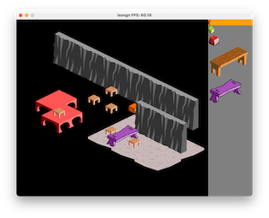

# isongn (iso-engine)

## What is it?

isongn is a cross-platform, open-world, isometric tile editor and game runner. Realize your old-school rpg/action-game dreams with easy-to-use modern technology!

## The tech

For graphics, isongn uses opengl. Instead of sorting isometric shapes [using the cpu](https://shaunlebron.github.io/IsometricBlocks/), isongn actually draws in 3d space and lets the gpu hardware sort the shapes in the z buffer. It's the best of both worlds: old school graphics and the power of modern hardware.

isongn is written in Go with minimal dependencies so it should run on all platforms.

## Plans!

Currently only a basic editor is supported however, coming soon I plan to add:
- sound support
- scripting support (you will be able to make games without any golang code)
- creatures/animated blocks
- intelligent/scripted editor (walls/beaches/etc)

2021 (c) Gabor Torok